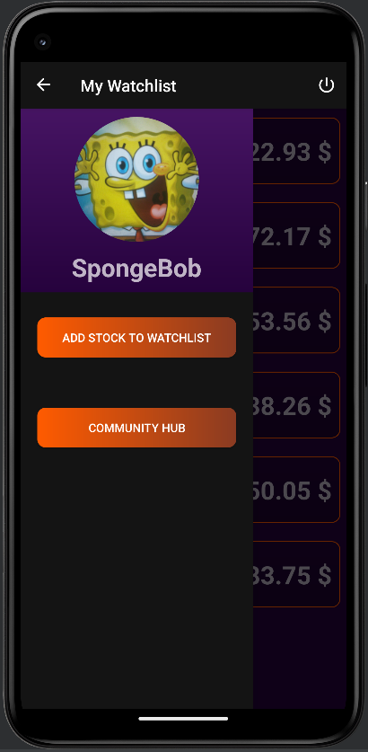

<h1>Alpha Trade</h1><br>
<p>It is a stock market watchlist application. User can add certain stocks listed in the NYSE(New York Stock Exchange) into their watchlist and track the current price of those stocks. User can view the daily price movement for the past 50 days for each of those stocks, user can see a brief description of the stock. User can also set reminders to check on a particular stock at a certain time in future.</p><br><br>

<h3>Output</h3><br>

<br>
Splash screen<br><br>

<br>
Login page<br><br>

<br>
Watchlist page<br><br>

<br>
Add-stock page<br><br>

<br>
Stock details page<br><br>

<br>
Navigation drawer. Community hub is planned to be a global-chat discuss section, it isn't implemented yet<br><br>

<h3>How to know which user is currently signed into the app in a device ?</h3><br>
We will store login-data locally. For this project I used shared preference. Data is of the form {bool loggedIn, userID}.<br>
```
val loggedInSharedPreferences = getSharedPreferences("LoggedIn", Context.MODE_PRIVATE)

if (!loggedInSharedPreferences.contains("login")) {

    loggedInSharedPreferences.edit().putString("login", loginDefault["login"]).apply() // To create LoggedIn sharedPreference if it doesn't exist
}

val loggedInData = loggedInSharedPreferences.getString("login", "")!!.split(", ").toMutableList() // Data is stored as ", " separated string, so we convert it into a list.


// Set up a handler to post a runnable that will start the next activity after a delay
Handler().postDelayed({

    val startAppIntent: Intent

    if (loggedInData[0].toBoolean()) { // loggedInData[0] will be the boolean indicating whether someone is already logged in or not
        startAppIntent = Intent(this, HomePage::class.java)
        startAppIntent.putExtra("UserID", loggedInData[1])
    }
    else {
        startAppIntent = Intent(this, LoginPage::class.java)
    }

    // Get the ActivityOptionsCompat object for the transition animation
    val options = ActivityOptionsCompat.makeSceneTransitionAnimation(
        this, logoImageView, ViewCompat.getTransitionName(logoImageView)!!
    )

    // Start the Login activity with the transition animation
    startActivity(startAppIntent, options.toBundle())
    finish()
}, TIME_OUT)
```
