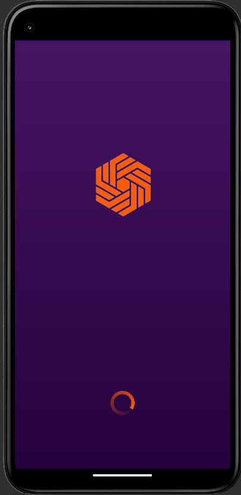

# Alpha Trade<br>
It is a stock market watchlist application. User can add certain stocks listed in the NYSE(New York Stock Exchange) into their watchlist and track the current price of those stocks. User can view the daily price movement for the past 50 days for each of those stocks, user can see a brief description of the stock. User can also set reminders to check on a particular stock at a certain time in future.<br><br>

## Output<br>

<br>
Splash screen<br><br>

<br>
Login page<br><br>

<br>
Watchlist page<br><br>

<br>
Add-stock page<br><br>

<br>
Stock details page<br><br>

<br>
Navigation drawer. Community hub is planned to be a global-chat discuss section, it isn't implemented yet.

<br>
***
<br>

## How to know which user is currently signed into the app in a device ?<br><br>
We will store login-data locally. For this project I used shared preference. Data is of the form {bool loggedIn, userID}.<br>
```kotlin
val loggedInSharedPreferences = getSharedPreferences("LoggedIn", Context.MODE_PRIVATE)

if (!loggedInSharedPreferences.contains("login")) {

    loggedInSharedPreferences.edit().putString("login", loginDefault["login"]).apply() // To create LoggedIn sharedPreference if it doesn't exist
}

val loggedInData = loggedInSharedPreferences.getString("login", "")!!.split(", ").toMutableList() // Data is stored as ", " separated string, so we convert it into a list.


// Set up a handler to post a runnable that will start the next activity after a delay
Handler().postDelayed({

    val startAppIntent: Intent

    if (loggedInData[0].toBoolean()) { // loggedInData[0] will be the boolean indicating whether someone is already logged in or not
        startAppIntent = Intent(this, HomePage::class.java)
        startAppIntent.putExtra("UserID", loggedInData[1])
    }
    else {
        startAppIntent = Intent(this, LoginPage::class.java)
    }

    // Get the ActivityOptionsCompat object for the transition animation
    val options = ActivityOptionsCompat.makeSceneTransitionAnimation(
        this, logoImageView, ViewCompat.getTransitionName(logoImageView)!!
    )

    // Start the Login activity with the transition animation
    startActivity(startAppIntent, options.toBundle())
    finish()
}, TIME_OUT)
```
<br>
--------------------------------------------------------------------------------------------------------------------
<br>

## How to login a user using Firebase Authentication ?<br><br>

```kotlin
var int = Intent(this,HomePage::class.java)

val user_id = uname.text.toString() // uname refers to the textview for username in login page
val password = pass.text.toString() // pass refers to the textview for password in login page

val auth = FirebaseAuth.getInstance() // Creating an instance of Firebase Authentication
auth.signInWithEmailAndPassword("$user_id@dummy.com", password) // Since this function allows login with email and password only, and as we have username instead of email. We pass in our username in the form of a dummy email
    .addOnCompleteListener { task -> // As signInWithEmailAndPassword is an asynchronous function, we will have to do all our next steps inside a call-back function
        if (task.isSuccessful) {
            // User authentication successful
            val user = auth.currentUser!!
            val uid = user.uid

            val loggedInSharedPreferences = getSharedPreferences("LoggedIn", Context.MODE_PRIVATE)
            val loggedInData = loggedInSharedPreferences.getString("login", "")!!.split(", ").toMutableList()
            loggedInData[0] = "true"
            loggedInData[1] = uid

            loggedInSharedPreferences.edit().putString("login", loggedInData.joinToString(", ")).apply()

            int.putExtra("UserID", uid)
            startActivity(int)
            finish()

        } else {
            // User authentication failed
            Toast.makeText(this, "Incorrect Id or Password", Toast.LENGTH_SHORT).show()
        }
    }
```
<br>
--------------------------------------------------------------------------------------------------------------------
<br>
